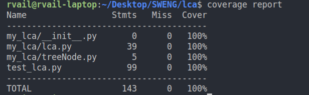
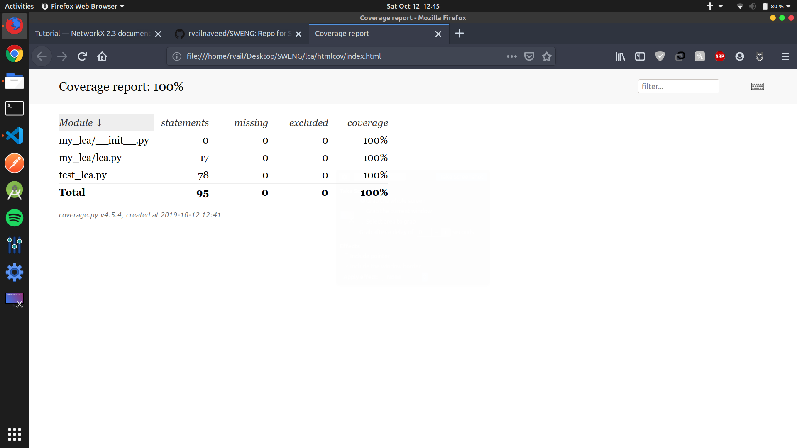
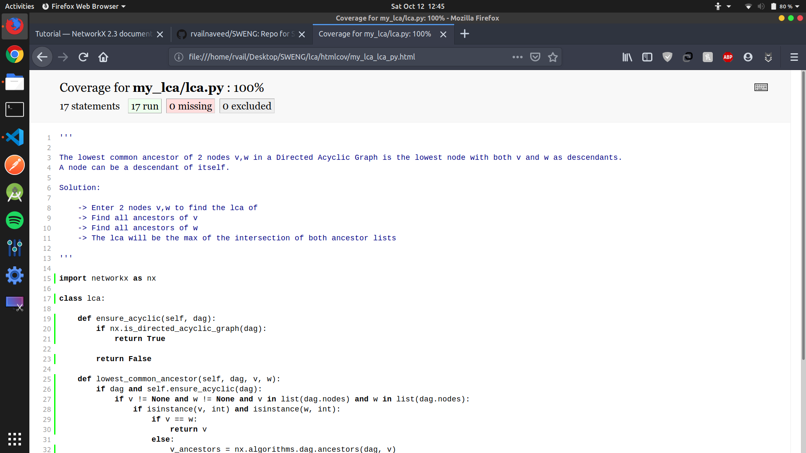

# Lowest Common Ancestor of a Binary Tree

+   Implementation contained in [lca.py](https://github.com/rvailnaveed/SWENG/blob/master/lca/my_lca/lca.py)
+   Tests in [test_lca.py](https://github.com/rvailnaveed/SWENG/blob/master/lca/test_lca.py)

## Getting Started
+   Clone or download the repo
+   cd into the `lca` folder:  `cd path/to/the/repo/lca` 
+   `pip3 install -r requirements.txt`

## Running the Tests
+   `python test_lca.py`

## Checking Code Coverage
+   `coverage run test_lca.py` then...

+   `coverage report` for coverage report in terminal

+   `coverage html` and open `index.html` inside newly created `htmlcov` folder in root directory for pretty report

