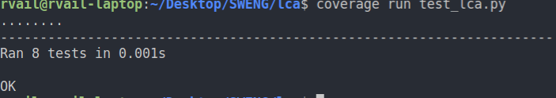

# Lowest Common Ancestor of a Directed Acyclic Graph

+   This implementation makes use of the `networkx` library.
+   Implementation contained in [lca.py](https://github.com/rvailnaveed/SWENG/blob/lca2/lca/my_lca/lca.py)
+   Tests in [test_lca.py](https://github.com/rvailnaveed/SWENG/blob/lca2/lca/test_lca.py)

## Getting Started
+   Have Python 3.0+ installed
+   Clone or download the repo 
+   Make sure you are in the `lca2` branch for the DAG version
+   cd into the `lca` folder: `cd path/to/the/repo/lca`
+   `pip3 install -r requirements.txt`

## Running the Tests
+   `python test_lca.py`

## Checking Code Coverage
+   Assuming you are in the `lca` folder...
+   `coverage run --omit */site-packages/* test_lca.py` then...

+   `coverage report` for coverage report in terminal

+   `coverage html` and open `index.html` inside newly created `htmlcov` folder in root directory for pretty report

